# PE1103N

## 1. Flash Image

The following instructions describe how to flash the image on **Ubuntu**.
If you would like to flash the image on **Windows**, please contact us through this page: [Contact our sales experts](https://www.connect.asus.com/ASUSIoT_ContactSales?utm_source=asus_site&utm_medium=banner&utm_campaign=HQ_AIoT+site_Contact+Sales) to obtain the relevant information.

### 1.1 Recovery Mode
1. **System Requirement**

    • Linux Host Computer (x86 Ubuntu 18.04 and above)

    • Micro USB cable

2. **Enter Force Recovery Mode**   
For PE1103N, please perform the following steps to enter Force Recovery Mode:   

**[PE1103N]**
   
   1. Power off the PE1103N and remove the power cable.
   2. Connect Host Computer and PE1103N Flash Port with Micro USB cable.
   3. Press and hold the Force Recovery Button.
   4. Connect the power cable and Power ON the PE1103N.
   5. After 3s release the Force Recovery Button.

**[Host Computer]**

On the Linux host PC, open a Terminal window and enter the command `lsusb`. If the returned content has one of the following outputs according to the Jetson SoM you use, then the board is in force recovery mode.

• For Orin NX 16GB: 0955:7323 NVidia Corp   
• For Orin NX 8GB: 0955:7423 NVidia Corp   
• For Orin Nano 8GB: 0955:7523 NVidia Corp   
• For Orin Nano 4GB: 0955:7623 NVidia Corp   


&nbsp;

### 1.2 Flash Image

**[Host Computer]**
1. Extract BSP file on Host Computer.

   BSP file example :

| System  | File Name |
| ------------- | ------------- |
| PE1103N Orin Nano 4GB  | PE1103N_JONAS_Orin-Nano-4GB-Super_JetPack-ssd-6.2.1_L4T-36.4.4_vX.X.X-official-xxxxxxxx.tar.gz  |
| PE1103N Orin Nano 8GB  | PE1103N_JONAS_Orin-Nano-8GB-Super_JetPack-ssd-6.2.1_L4T-36.4.4_vX.X.X-official-xxxxxxxx.tar.gz |
| PE1103N Orin NX 8GB  | PE1103N_JONAS_Orin-NX-8GB-Super_JetPack-ssd-6.2.1_L4T-36.4.4_vX.X.X-official-xxxxxxxx.tar.gz  |
| PE1103N Orin NX 16GB  | PE1103N_JONAS_Orin-NX-16GB-Super_JetPack-ssd-6.2.1_L4T-36.4.4_vX.X.X-official-xxxxxxxx.tar.gz  |

Download Link : 

```
sudo tar -xvf PE1103N_xxxxx.tar.gz 
```

2. Change folder and Flash image

```
cd mfi_PE110xxxxxxxx  
sudo ./flash.sh
```

3. Flashing the image takes around 15 minutes.

**[PE1103N]**   
   After 15 minutes, PE1103N will auto reboot.

>NOTE :
> 1. Do not use a USB Hub between Host Computer and PE1103N.
> 2. You can know the process of flashing image from “mfi_PE1103N-orin-super/initrdlog”.

&nbsp;


## 2. Build Image

### 2.1 Jetpack 6.2 image

1. Installing Prerequisites
```
$ sudo apt update
$ sudo apt install -y apt-utils bc build-essential cpio curl \
device-tree-compiler expect gawk gdisk git kmod liblz4-tool libssl-dev \
locales parted python3 qemu-user-static rsync \
software-properties-common sudo time tzdata udev unzip wget zip \
nfs-kernel-server uuid-runtime
```

2. Download and prepare the Linux_for_Tegra source code
```
$ wget https://developer.nvidia.com/downloads/embedded/l4t/r36_release_v4.4/release/Jetson_Linux_r36.4.4_aarch64.tbz2
$ tar xf Jetson_Linux_r36.4.4_aarch64.tbz2
```

3. Download and prepare sample root file system
```
$ wget https://developer.nvidia.com/downloads/embedded/l4t/r36_release_v4.4/release/Tegra_Linux_Sample-Root-Filesystem_r36.4.4_aarch64.tbz2
$ sudo tar xpf Tegra_Linux_Sample-Root-Filesystem_r36.4.4_aarch64.tbz2 -C Linux_for_Tegra/rootfs/
```

4. Sync the source code for compiling
```
$ cd Linux_for_Tegra/source/
$ ./source_sync.sh -t jetson_36.4.4
```

* If the following error occurs, please wait for Nvidia to fix it.

   

   Reference: https://forums.developer.nvidia.com/t/unable-to-connect-to-nv-tegra-nvidia-com/334353

5. Download the patch file for PE1103N (same as PE1100N v2.0.13)

   https://drive.google.com/file/d/16bBWBo0W76Jx1aqiLgpvUs6zsbjxPNhW/view?usp=sharing

   Copy it in the same location as the Linux_for_Tegra folder.

   

6. Overwrite the original source code by patch files
```
$ cd ../..
$ tar zxf PE1100N_v2.0.13_patch.tar.gz
$ sudo cp -r PE1100N_v2.0.13_patch/Linux_for_Tegra/* Linux_for_Tegra/
```

7. Apply necessary changes to rootfs
```
$ cd Linux_for_Tegra
$ sudo ./apply_binaries.sh
```

8. Download and install the toolchain
```
$ wget https://developer.nvidia.com/downloads/embedded/l4t/r36_release_v3.0/toolchain/aarch64--glibc--stable-2022.08-1.tar.bz2
$ sudo tar xf aarch64--glibc--stable-2022.08-1.tar.bz2 -C /opt
$ rm aarch64--glibc--stable-2022.08-1.tar.bz2
```

9. Build the SSD image
```
$ sudo ./asus/buildasus.sh
```


10. Flash image to device

Installing the flash requirements
```
$ sudo ./tools/l4t_flash_prerequisites.sh
```

Set up the device in recovery mode, then flash the image.
```
$ cd mfi_PE1103N-orin-super
$ sudo ./tools/kernel_flash/l4t_initrd_flash.sh --erase-all --flash-only --showlogs --network usb0
```

&nbsp;


## 3. Flashing a Backup Image to Multiple Devices

**Prerequisites**   
   a. Ubuntu Host PC 20.04 or 22.04   
   b. Micro USB cable   

1. Installing Prerequisites
```
$ sudo apt update
$ sudo apt install -y abootimg binfmt-support binutils cpio cpp device-tree-compiler dosfstools \
iproute2 iputils-ping lbzip2 libxml2-utils netcat nfs-kernel-server openssl python3-yaml qemu-user-static \
rsync sshpass udev uuid-runtime whois xmlstarlet zstd lz4 chrpath diffstat xxd wget bc
```

2. Download and prepare the Nvidia Jetpack SDK
```
$ wget https://developer.nvidia.com/downloads/embedded/l4t/r36_release_v4.4/release/Jetson_Linux_r36.4.4_aarch64.tbz2
$ tar xf Jetson_Linux_r36.4.4_aarch64.tbz2
```
   After extracting the Jetson_Linux_r36.4.4_aarch64.tbz2 file, you will see a Linux_for_Tegra folder.   

   

3. Download and prepare sample root file system
```
$ wget https://developer.nvidia.com/downloads/embedded/l4t/r36_release_v4.4/release/Tegra_Linux_Sample-Root-Filesystem_r36.4.4_aarch64.tbz2
$ sudo tar xpf Tegra_Linux_Sample-Root-Filesystem_r36.4.4_aarch64.tbz2 -C Linux_for_Tegra/rootfs/
```

4. Download the backup and restore patch file for PE1103N

   https://reurl.cc/4lMAdv

5. Place the file MultiFlash_Tool_Jetson Orin_1.0.0.tar in the same directory as the Linux_for_Tegra folder

   

6. Overwrite the original SDK by patch files
```
$ tar xf MultiFlash_Tool_Jetson Orin_1.0.0.tar
$ sudo cp -r MultiFlash_Tool_Jetson Orin_1.0.0.tar/Linux_for_Tegra/* Linux_for_Tegra
```

7. Applies the binaries to the rootfs.
```
$ cd Linux_for_Tegra
$ sudo ./ apply_binaries.sh
```

8. Create the backup image

   a. Enter Force Recovery Mode on the PE1103N   
      * Power off the PE1103N and remove the power cable.
      * Connect Host Computer and PE1103N Flash Port with Micro USB cable.
      * Press and hold the Force Recovery Button.
      * Connect the power cable and Power ON the PE1103N.
      * After 3s release the Force Recovery Button.

   b. Run this command from the Linux_for_Tegra folder on host PC: 
      ```
      $ sudo ./Jetson Orin_generate_backup_image.sh
      ```

      If this command completes successfully, a backup image is stored in **Linux_for_Tegra/tools/backup_restore/images.**

   c. After successful backup, you can manually reset the device.

9. Create the massflash image

   a. Enter Force Recovery Mode on the PE1103N   
      * Power off the PE1103N and remove the power cable.
      * Connect Host Computer and PE1103N Flash Port with Micro USB cable.
      * Press and hold the Force Recovery Button.
      * Connect the power cable and Power ON the PE1103N.
      * After 3s release the Force Recovery Button.

   b. Run this command from the Linux_for_Tegra folder on host PC: 
      ```
      $ sudo ./Jetson Orin_generate_massflash_image.sh 
      ```

      If this command completes successfully, a massflash image is stored in **Linux_for_Tegra/mfi_jetson-orin-nano-devkit**

   c. After successful generate image, you can manually reset the device.

10. Flash the image to one or more PE1103N devices simultaneously

   a. Enter Force Recovery Mode on the PE1103N
      * Power off the PE1103N and remove the power cable.
      * Connect Host Computer and PE1103N Flash Port with Micro USB cable.
      * Press and hold the Force Recovery Button.
      * Connect the power cable and Power ON the PE1103N.
      * After 3s release the Force Recovery Button.

   b. Run this command from the Linux_for_Tegra folder on host PC:
      ```
      $ sudo ./Jetson Orin_flash_image.sh
      ```

   c. After a successful flash, please power off and reboot the device.


>NOTE :
> 1. The maximum number of devices that can be flashed simultaneously is 10. 
> 2. Please do not use a USB hub to connect the PE1103N, as it may cause flashing failures due to insufficient power supply or unstable signal quality.

&nbsp;


## 4. LTE Setting 

### 4.1 How to set up a SIM card   
> NOTE : Please insert the SIM card and power on the device.
1. Click to open the settings bar at the top right side of the desktop.
  

2. Click **Mobile Broadband Settings**


3. **Switch on** the Mobile Broadband to enable LTE function   


4. Open the Network bar below the IMEI


5. Select **Add new connection**


6. Click **Next** on the top right of the window


7. Select your country


8. Select your provider


9. Select your plan


10. Click **Apply** on the top right of the window


11. It will use this configure to connect to the internet automatically


12. The current signal strength also appear on the settings bar


&nbsp;

### 4.2 How to switch SIM card slot   
1. Open **Terminal** on the desktop


2. Type command `sudo asus-config`, if it asks for a password, enter **the password set by yourself**. Press Enter.


3. Select **Ok**


4. Select **5. SIM  Select SIM slot** and press Enter


5. Select **1 SIM1** or **2 SIM2** and press Enter


6. Select **Finish** and press Enter


7. Select **Yes** and press Enter to reboot


&nbsp;

### 4.3 How to check SIM card status
1. Open **Terminal** on the desktop


2. Type command ‘`sudo asus-config`’, if it asks for a password, enter **the password set by yourself**. Press Enter.


3. Select **Ok**


4. Select **7. Configuration** and press Enter


5. Check **SIM slot** and **SIM state** on the screen


&nbsp;

## 5. Config Tool 

Open Terminal on the desktop. Type command `sudo asus-config`, if it asks for a password, enter the password set by yourself. Press Enter.


Select Ok using the keyboard.


1. Hostname: Set Hostname.


2. Console: Enable/Disable more kernel massages at boot time.


3. COM1 port: Set COM1 port mode to RS232, RS422 or RS485.


4. COM2 port: Set COM2 port mode to RS232, RS422 or RS485.


5. SIM: Select SIM slot (SIM1/SIM2).


6. Configuration: The setting status of the COM/SIM/M.2 slot.


7. About: Information of this tool.


## 6. Switch DIO Instructions 

1. Open Terminal on the desktop
2. Type below command to switch DIO

```
Set one DO Value: sudo dio_out #DO_Num # Value
Get one DI Value: sudo dio_in #DO_Num
Get all DO Value: sudo dio_out
Get all DI Value: sudo dio_in
```

## 7. LED Functions 

### 7.1 Turn on/off LED

1. Open Terminal on the desktop
2. Below command are examples to turn on LED (Type Echo 1 or 0 for turning on/off LED)

```
ETH0 : sudo echo 1 > /sys/class/leds/eth0-led/brightness
ETH1: sudo echo 1 > /sys/class/leds/eth1-led/brightness
UART0: sudo echo 1 > /sys/class/leds/uart0-led/brightness
UART1: sudo echo 1 > /sys/class/leds/uart1-led/brightness
CAN: sudo echo 1 > /sys/class/leds/can-led/brightness
WIFI: sudo echo 1 > "/sys/class/leds/wifi-led/brightness
LTE: sudo echo 1 > /sys/class/leds/lte-led/brightness
```

### 7.2 Disable kernel LED function

1. Open Terminal on the desktop
2. Type below commands to disable kernel LED function

```
ETH0: sudo echo none > /sys/class/leds/eth0-led/trigger
ETH1: sudo echo none > /sys/class/leds/eth1-led/trigger
UART0: sudo echo none > /sys/class/leds/uart0-led/trigger
UART1: sudo echo none > /sys/class/leds/uart1-led/trigger
CAN: sudo echo none > /sys/class/leds/can-led/trigger
WIFI: sudo echo none > /sys/class/leds/wifi-led/trigger
LTE: sudo echo none > /sys/class/leds/lte-led/trigger
```

### 7.3 Recover Kernel LED function

1. Open Terminal on the desktop
2. Type below commands to recover kernel LED function

```
ETH0: sudo echo eth0 > /sys/class/leds/eth0-led/trigger
ETH1: sudo echo eth1 > /sys/class/leds/eth1-led/trigger
UART0: sudo echo uart0 > /sys/class/leds/uart0-led/trigger
UART1: : sudo echo uart1 > /sys/class/leds/uart1-led/trigger
CAN: sudo echo can > /sys/class/leds/can-led/trigger
WIFI: sudo echo wifi > /sys/class/leds/wifi-led/trigger
LTE: sudo echo lte > /sys/class/leds/lte-led/trigger
```


## 8. Precision Time Synchronization (PTP & PPS) 

PE1103N supports precision time synchronization using PTP (Precision Time Protocol), GPS, and PPS (Pulse Per Second) signals. This section walks you through the setup step by step, starting from verifying hardware capability to advanced multi-source synchronization.

**Supported methods:**
- PHC (PTP Hardware Clock) synchronization — synchronize the system clock to the device's own hardware clock
- PTP synchronization — synchronize time between two devices over Ethernet
- GPS + PPS synchronization — use an external GPS module as a highly accurate time source
- PTP + PPS synchronization — combine a PTP time source with PPS for sub-microsecond accuracy

**Hardware requirements:**
- PTP sync: Two PE1103N devices (or one PE1103N and another PTP-capable device) connected via Ethernet cable
- GPS sync: PE1103N with a u-blox 9 (or compatible) GPS module connected via serial and GPIO

&nbsp;

### 8.1 Prerequisites — Verify Hardware Timestamp Support

Before setting up any time synchronization, confirm which Ethernet interface on your PE1103N supports hardware timestamping. This is required for PTP to work correctly.

1. Open Terminal and switch to root:
```
sudo su
```
Enter the device password when prompted.

2. List all network interfaces to find the interface names:
```
ifconfig
```
Look for interfaces named `eth0`, `eth1`, `eth2`, etc.

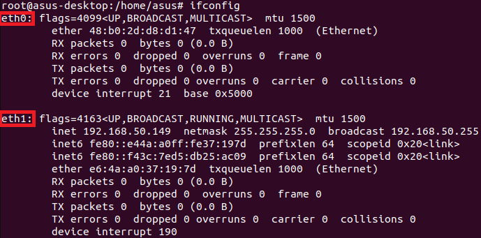

3. Check whether an interface supports hardware timestamping. The following example uses `eth1`:
```
ethtool -T eth1
```
In the output, look for these three items:
- `hardware-transmit`
- `hardware-receive`
- `hardware-raw-clock`

If all three are present, the interface supports hardware timestamping and is suitable for PTP.

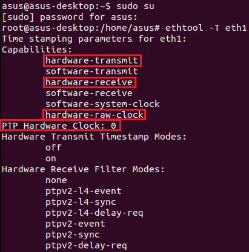

Also note the `PTP Hardware Clock` number. For example, `PTP Hardware Clock: 0` means the PTP hardware clock is accessible as `/dev/ptp0`.

> NOTE: Use an interface that supports hardware timestamping for all time synchronization setups in this guide. The examples below use `eth1`.

&nbsp;

### 8.2 PHC Stability Verification

**Goal:** Verify that the PTP Hardware Clock (PHC) built into the network interface is working, and synchronize the PE1103N system clock to it.

The PHC is a hardware clock inside the network interface card. Verifying it first gives you a stable time baseline before connecting to other devices or external sources.

1. Open Terminal and switch to root. Disable certain offload features on `eth1` to improve timing stability:
```
ethtool -K eth1 tx-udp_tnl-segmentation off
ethtool -K eth1 tso off
ethtool -K eth1 lro off
ethtool -K eth1 gro off
ethtool -K eth1 ntuple off
ethtool -K eth1 rx-gro-hw off
```

2. Connect `eth1` to a network, then run `ptp4l` in slave mode to adjust the time offset of the PHC:
```
ptp4l -2 -i eth1 -m -H -s
```
Leave this running.

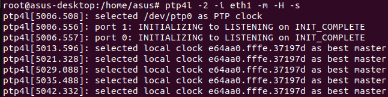

3. Open a new terminal window. Edit the Chrony configuration file:
```
vim /etc/chrony/chrony.conf
```
Add the following line:
```
refclock PHC /dev/ptp0 poll 0 dpoll -2 offset 0
```
Save and exit.

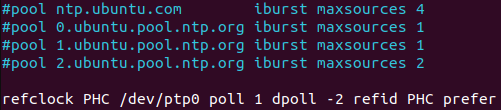

4. Restart Chrony to apply the changes:
```
systemctl restart chrony
```

5. Wait about 30 seconds, then check the synchronization status:
```
chronyc sources -v
```
A successful result looks similar to the following:
```
#* PHC0   0   1   377   1   -2ns[  +1ns] +/-   33ns
```
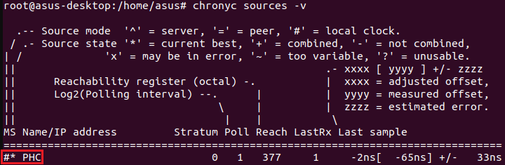

`reach=377` means the synchronization is stable. The offset value (e.g., `-2ns`) shows how closely the system clock is aligned to the PHC. A small offset (within ±100ns) confirms that the PE1103N system clock is successfully synchronized to the PHC.

&nbsp;

### 8.3 PTP Time Synchronization Between Two Devices

**Goal:** Synchronize the system time of a slave device to a master device over Ethernet using PTP.

**Hardware setup:** Connect the `eth1` port of the master PE1103N directly to an Ethernet port on the slave device using an Ethernet cable.

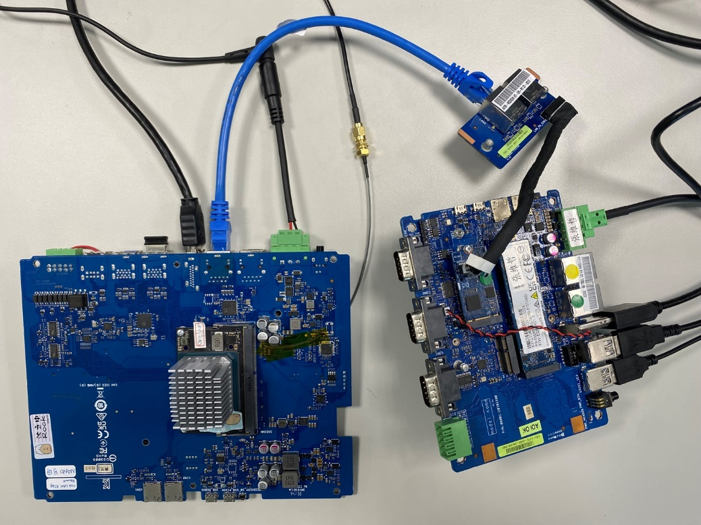

> NOTE: In this guide, PE1103N acts as the PTP master. The slave can be another PE1103N or any PTP-compatible device.

**On the Master device (PE1103N):**

1. Open Terminal and switch to root. Start `ptp4l` as master:
```
ptp4l -2 -i eth1 -m -H
```
The master is now broadcasting PTP time over the network.

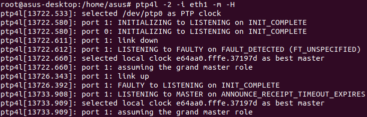

2. (Optional) Verify that the PHC is reading the correct time:
```
phc_ctl /dev/ptp0 get
```
This returns the current timestamp from the hardware clock.

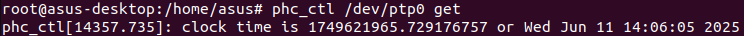

**On the Slave device:**

1. Open Terminal and switch to root. In this example, the slave uses `eth3`. Start `ptp4l` as slave:
```
ptp4l -2 -i eth3 -m -H -s
```
Watch the `master offset` value in the terminal output. This value shows the time difference between the master and the slave. It should decrease and stabilize as synchronization progresses.

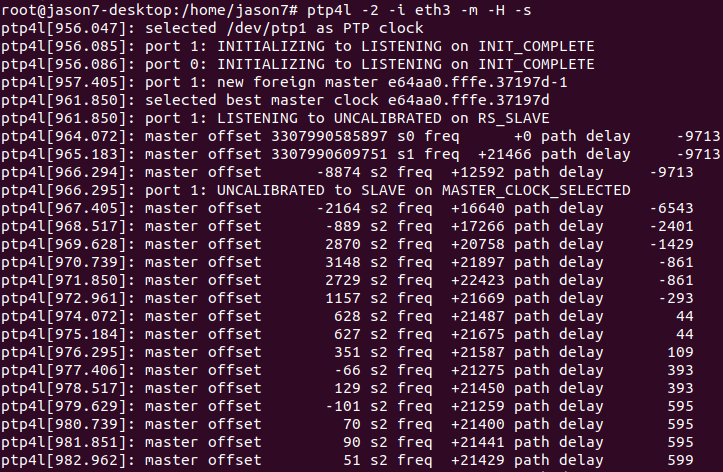

2. Once the offset is stable, open a new terminal window and run `phc2sys` to keep the slave's system clock aligned to its PHC:
```
phc2sys -s eth3 -c CLOCK_REALTIME -w -m
```
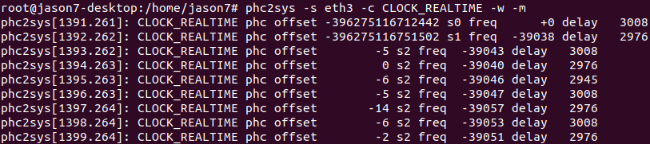

When the `offset` in the output is near 0 (typically within ±100ns), the slave's system clock is successfully synchronized to the master PE1103N.

&nbsp;

### 8.4 GPS + PPS Synchronization

**Goal:** Use an external GPS module as a highly accurate time source. The GPS signal provides absolute UTC time, and the PPS signal aligns each second boundary with nanosecond precision.

**Hardware required:** u-blox 9 GPS module connected to PE1103N (serial port for GPS data, GPIO pin for PPS signal).

1. Open Terminal and switch to root. Confirm that the PPS signal is registered in the system:
```
dmesg | grep "pps"
```
You should see a PPS device listed, for example `/dev/pps1`.

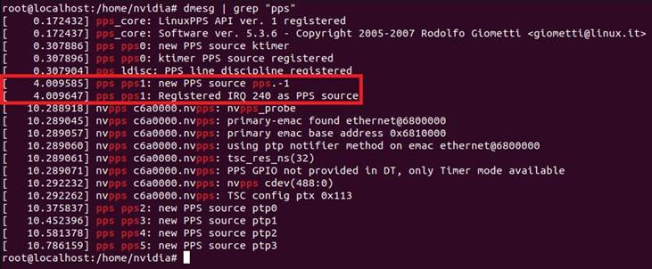

2. Test the PPS signal to confirm it is active:
```
ppstest /dev/pps1
```
You should see a new timestamp output every second.

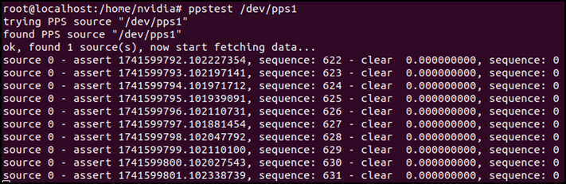

If you disconnect the GPIO wire, a timeout message will appear — this confirms the PPS signal is coming from the GPS module and not from another source.

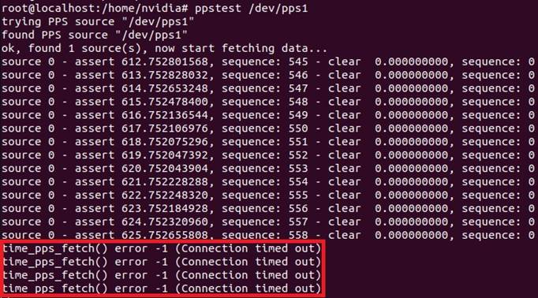

3. Configure the GPS daemon. Open `/etc/default/gpsd`:
```
vim /etc/default/gpsd
```
Set the following values:
```
DEVICES="/dev/ttyTHS1 /dev/pps1"
GPSD_OPTIONS="-n"
```
Save and exit.

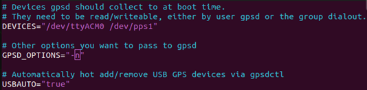

4. Restart gpsd:
```
systemctl restart gpsd.socket gpsd
```

5. Verify that GPS data is being received:
```
gpsmon
```
You should see satellite data and a PPS signal value updating in real time. Press `q` to exit.

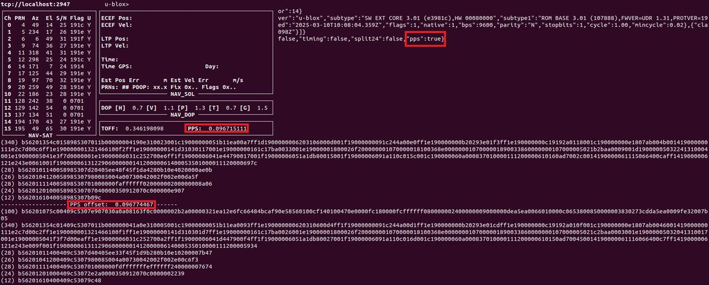

6. Edit the Chrony configuration to use GPS + PPS as the time source:
```
vim /etc/chrony/chrony.conf
```
If you added lines in Section 12.2, comment them out first. Then add:
```
refclock SHM 0 refid GPS precision 1e-1 offset 0.9999 delay 0.2
refclock PPS /dev/pps1 refid PPS lock GPS precision 1e-9
```
Save and exit.

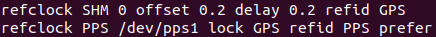

7. Restart Chrony and verify the result:
```
systemctl restart chrony
```
Wait about 30 seconds, then run:
```
chronyc sources -v
```
A successful result looks similar to the following:
```
#* GPS   0   4   377   26  +432us[+432us] +/- 1278us
#+ PPS   0  -2   377    1  +132ns[  +66ns] +/-   59ns
```
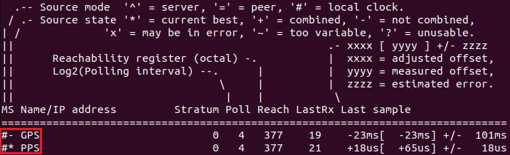

`GPS` is the primary source (from the GPS module via SHM). `PPS` is the secondary source that provides fine sub-microsecond correction. Together, they give the PE1103N highly accurate, GPS-referenced time.

&nbsp;

### 8.5 PTP + PPS Synchronization

**Goal:** Use a PTP master on the network as the primary time source, and use the PPS signal to further improve time accuracy.

This is useful when your deployment has an existing PTP network infrastructure and you also have a PPS signal available on the device.

1. Open Terminal and switch to root. Connect `eth1` to the network. Start `ptp4l` in slave mode:
```
ptp4l -2 -i eth1 -m -H -s
```
Leave this running.

2. Open a new terminal window. Edit the Chrony configuration:
```
vim /etc/chrony/chrony.conf
```
If you added lines in Section 12.4, comment them out first. Then add:
```
refclock PHC /dev/ptp0 poll 0 dpoll -2 offset 0
refclock PPS /dev/pps1 refid PPS lock PHC precision 1e-9
```
Save and exit.

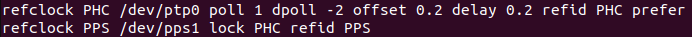

3. Restart Chrony:
```
systemctl restart chrony
```

4. Wait about 30 seconds, then verify:
```
chronyc sources -v
```
A successful result looks similar to the following:
```
#* PHC0   0   1   377   1  +10ns[ +10ns] +/-   45ns
#+ PPS    0  -2   377   1   +8ns[  +8ns] +/-   29ns
```
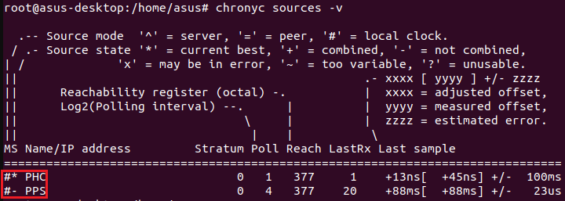

`PHC0` is the primary source, synchronized via PTP to the network master. `PPS` is the secondary source providing sub-nanosecond alignment. This combination gives the PE1103N very high time accuracy referenced to your PTP network.


## 9. Others 

### 9.1 Get Console Log
#### 9.1.1 Host PC : Windows
1. Connect PE1103N console port to a PC with Micro USB cable. 

   Open Device Manager on PC, **USB TO UART BRIDGE** may appear in Device Manager.

  

2. In this case, you need to download the driver (F81232_231115_whql.zip) and update it.

[F81232_231115_whql.zip](https://github.com/ASUS-IPC/ASUS-IPC/files/15477566/F81232_231115_whql.zip)


3. Install and open the PuTTY, select **Serial** and input the COM* and Speed is **115200**.


4. Click the Open button on PuTTY and power on the PE1103N, and some boot logs will printed on PuTTY from PC. 


#### 9.1.2 Host PC : Ubuntu

1. Install minicom on Linux PC
```
sudo apt update
sudo apt install minicom
```

2. Connect Micro USB cable to the console port on PE1103N

3. Check if /dev/ttyUSB0 exists

4. Execute the script to capture logs [log_uart.zip](https://github.com/user-attachments/files/21115587/log_uart.zip)
```
sudo ./log_uart.sh
```
> If you want to exit minicom, press Ctrl+A, then press X.

5. The log will be generated in the uart_logs folder.


 


